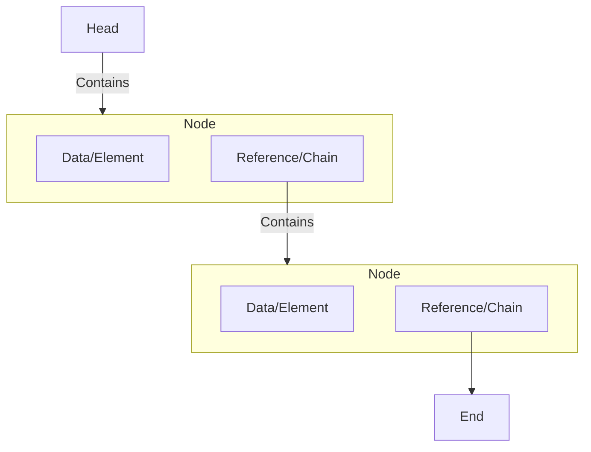
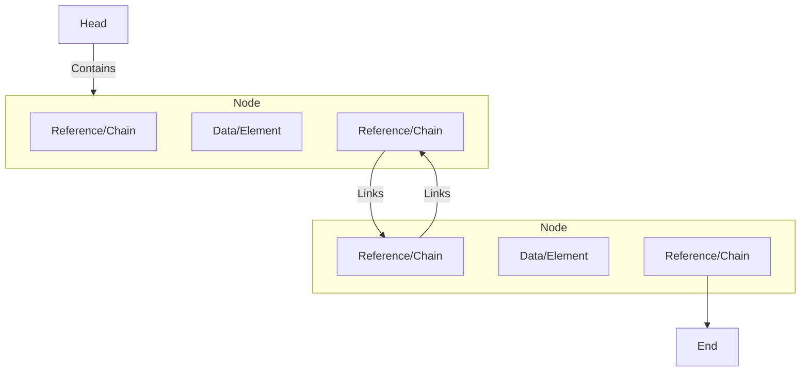

# Lecture 2 Lists

##### Abstract Data Types (ADT)
An abstract data type is a data type (a set of instructions) that has been generally/vaguely communicated. For example, a 'stack' is like a python list or index-array, but it only has two functions, `.push()` and `.pop()`. the `.push()` and `.pop()` function add an item and remove an item to the end of the 'stack' respectively. However, the code needed for the implementation of the actions of insertion and deletion is not created. It's like saying 'The engine is going to run at a specific speed' without getting into the specific of how teh engine works.

With an ADT approach, it is much easier to communicate code because different systems use similar libraries but in different ways.

#### Positional List
###### Singly-Linked List
Positional lists are a type of ADT, and one of its types are singly-linked lists. Elements are stored at 'positions' rather than index. Below is a generalized flow chart to visualize a singly linked list.

Simply put, the head of a singly linked list 'contains' a node (technically, the head contains the address to the first node). And inside each node, there is data and a 'reference/chain'. That 'reference/chain' contains another node, which also has data and another 'reference/chain'. This cycle goes on until the end of teh singly linked list.

More realistically, each node contains two addresses. One address links to data stored in memory, the other address links to another node (data that stores two more addresses)

###### Doubly-Linked List

This is basically the same as a singly-linked list, but with two references. One reference is linked to the next node, and the other is linked to the previous node.

