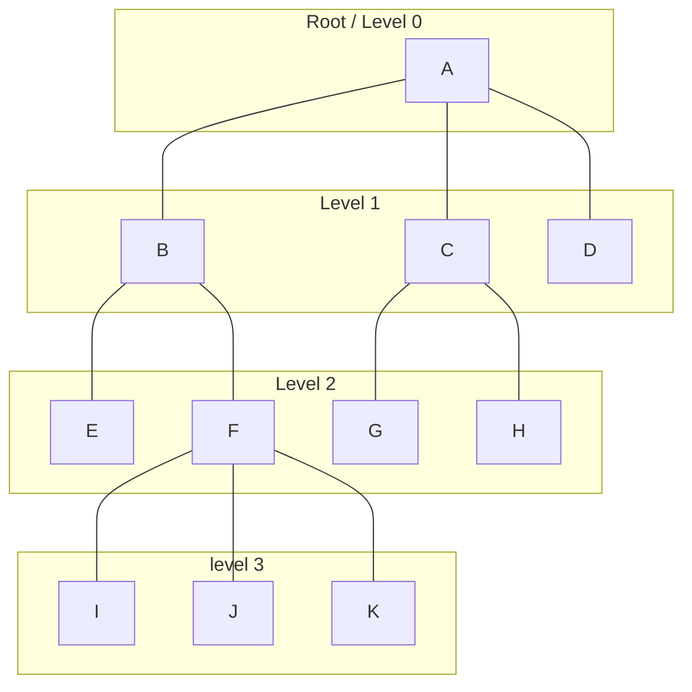
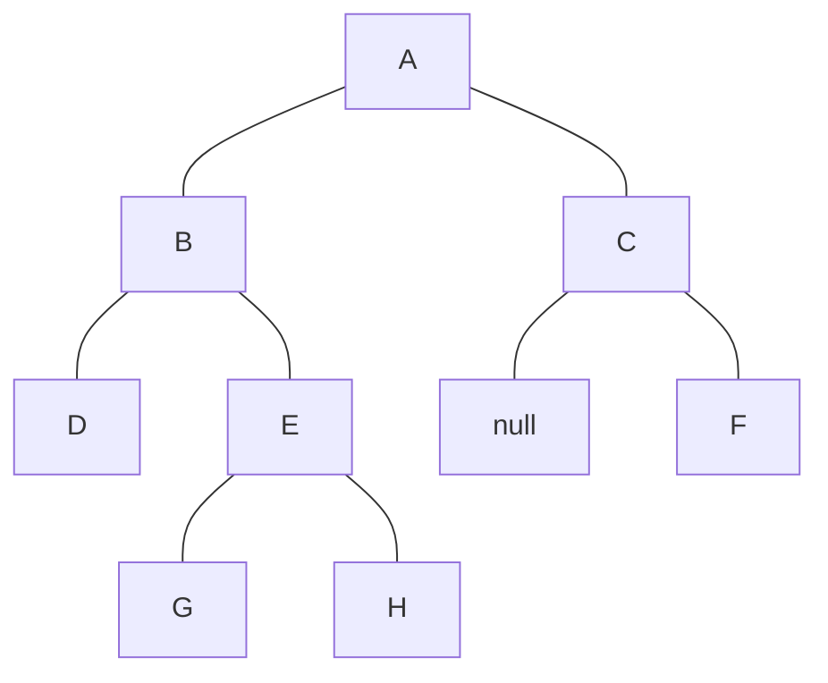

# Lecture 3 Trees

#### Tree

A tree is an abstract model of a hierarchical structure. The relationship between nodes is that of a family (parents, children and siblings). Each node has at most 1 parent and can have zero or more children.

##### Terminology


- **Root**: A node without a parent (usually present a the top of a tree)
- **Internal Node**: A node with **at least** one child
- **External Node (Leaf Node)**: A node without children
- **Sibling**: Nodes with the same parent
- **Descendants**: The child and grandchild, etc. of a node
- **Ancestors**: The parents and grandparents, etc. of a a node
- **Depth**: Number of ancestors including the node itself
- **Level**: The set of nodes with a given depth
- **Height**: Maximum depth of a tree

##### Standard Tree
When setting up a tree in code, it follows a similar structure to that of a linked list, but with a few differences.
Each node typically has the following attributes
- Value
- Children
- Parent (optional)



###### Pre Order Traversal of a Tree
This is one of two ways that a tree can be traversed. This method starts from the root, then moves down to the left until it hits a leaf node. Once it hits a leaf node, it will move to the parent of the leaf node and look for the leaf nodes siblings (from left to right). Below is a pre order traversal of the tree above, reading from the top to the bottom.

```
A
    B
        E
        F
            I
            J
            K
    C
        G
        H
    D
```

###### Post Order Traversal of a Tree
This is the second of two ways that a tree can be traversed. This method starts from the node in the far left, moving to the right, starting from the bottom then moving up.

```
E
I
J
K
    F
        B
G
H
    C
D
            A
```

#### Binary Trees
Has the following properties:
- Each node has at most 2 children
- Each child node is labelled as a left or right child
- Child ordering is left followed by right

In the following chart, it can be seen that G is the left child of E. Similarly, F is the right child of C (Ignore the null). In binary trees, this kind of formatting is very important!



###### In Order Traversal
This method is similar to that of post order traversal. It starts from the node in the far left and moves right, then from the bottom to the top.
```
D
    B
G
    E
H
            A
    F
        C
```

